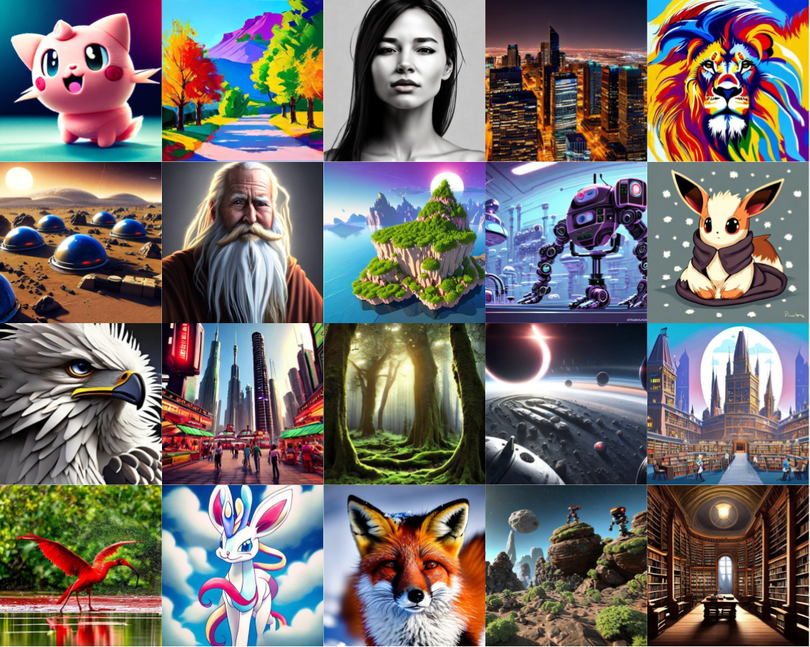

# Diffusion-KTO: Aligning Diffusion Models by Optimizing Human Utility

<p align="center">
     <br>
</p>


This repository contains the official code and checkpoints used in the paper "[Aligning Diffusion Models by Optimizing Human Utility](https://arxiv.org/abs/2404.04465)"


## Abstract
We present Diffusion-KTO, a novel approach for aligning text-to-image diffusion models by formulating the alignment objective as the maximization of expected human utility. Since this objective applies to each generation independently, Diffusion-KTO does not require collecting costly pairwise preference data nor training a complex reward model. Instead, our objective requires simple per-image binary feedback signals, e.g. likes or dislikes, which are abundantly available. After fine-tuning using Diffusion-KTO, text-to-image diffusion models exhibit superior performance compared to existing techniques, including supervised fine-tuning and Diffusion-DPO, both in terms of human judgment and automatic evaluation metrics such as PickScore and ImageReward. Overall, Diffusion-KTO unlocks the potential of leveraging readily available per-image binary signals and broadens the applicability of aligning text-to-image diffusion models with human preferences.


## Checkpoint

SD-v1.5 HuggingFace(https://huggingface.co/jacklishufan/diffusion-kto/)

## Usage
```python
import torch
from diffusers import AutoencoderKL, UNet2DConditionModel, DiffusionPipeline
vae_path = model_name = "runwayml/stable-diffusion-v1-5"
device = 'cuda'
weight_dtype = torch.float16
vae = AutoencoderKL.from_pretrained(
    vae_path,
    subfolder="vae",
)
unet = UNet2DConditionModel.from_pretrained(
    "jacklishufan/diffusion-kto", subfolder="unet",
)
pipeline = DiffusionPipeline.from_pretrained(
    model_name,
    vae=vae,
    unet=unet,
    device=device,
).to(device).to(weight_dtype)


result = pipeline(
    prompt="Self-portrait oil painting, a beautiful cyborg with golden hair, 8k",
    num_inference_steps=50,
    guidance_scale=7.0
)
img = result[0][0]

```


## Datasets

We used a processed version of [Pick-a-Pic](https://huggingface.co/datasets/yuvalkirstain/pickapic_v2) with binary label instead of pair-wise preference. The processed annotation `train_processed_v3.csv` can be found at [Huggingface](https://huggingface.co/datasets/jacklishufan/pick-a-pick-kto-processed).

Please download the original Pick-a-Pic dataset and preprocessed annotation and organize the data folder in the following manner:

```
<root of pick-a-pic>
-train_processed_v3.csv
-train
--- 17a0ce90-9e1c-4366-82c7-aa5977b06375.jpg
-- ... 
```

## Training on Custom Data
Please prepare a folder in the following format 

```
<root of your-dataset>
-train_processed_v3.csv
-train
--- 0001.jpg
-- ... 
```

wheere train_processed_v3.csv should contain the following columns:

```
file_path: string, relative path of image
caption: string, prompt
label: string, use "exclusive_win" for winning samples and "exclusive_lose" for losing samples 
```


## Training

``` 
bash exps/example.sh 
```

## Citation
```
@misc{li2024aligning,
      title={Aligning Diffusion Models by Optimizing Human Utility}, 
      author={Shufan Li and Konstantinos Kallidromitis and Akash Gokul and Yusuke Kato and Kazuki Kozuka},
      year={2024},
      eprint={2404.04465},
      archivePrefix={arXiv},
      primaryClass={cs.CV}
}
```
